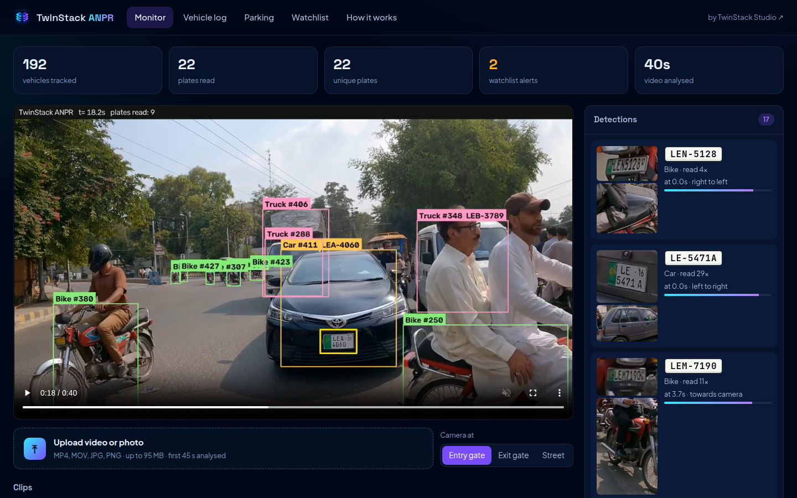
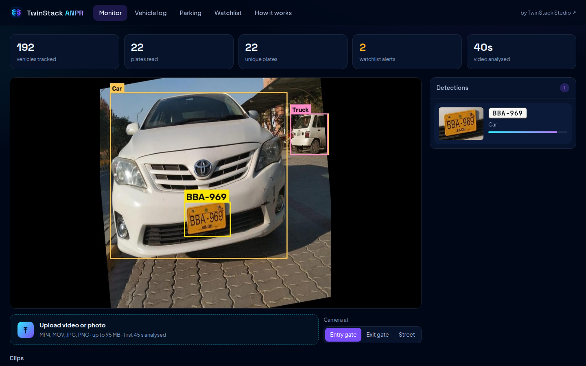
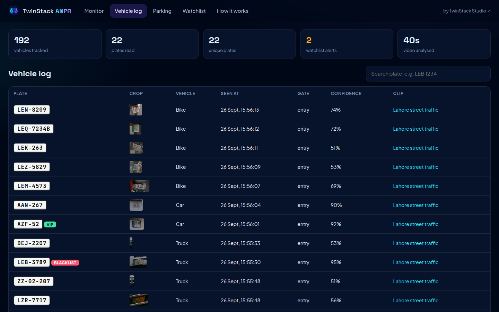
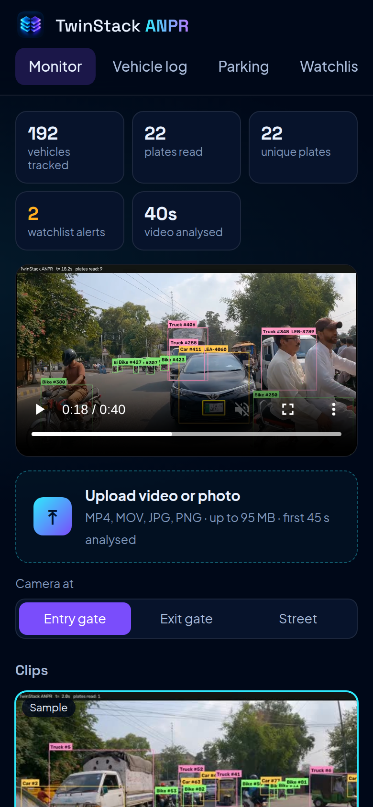
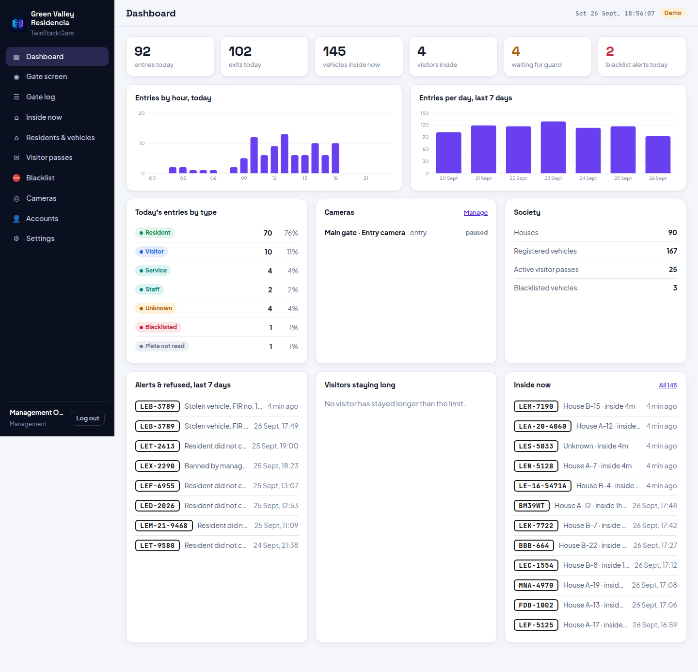
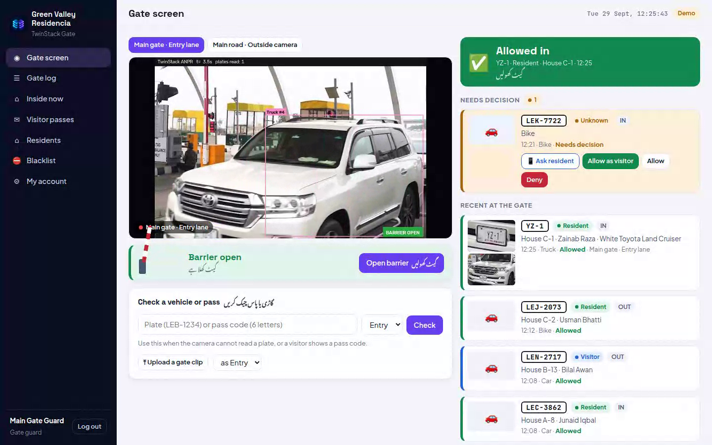
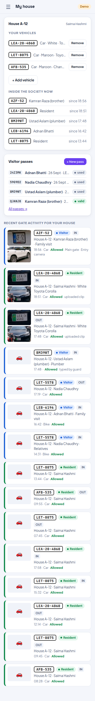
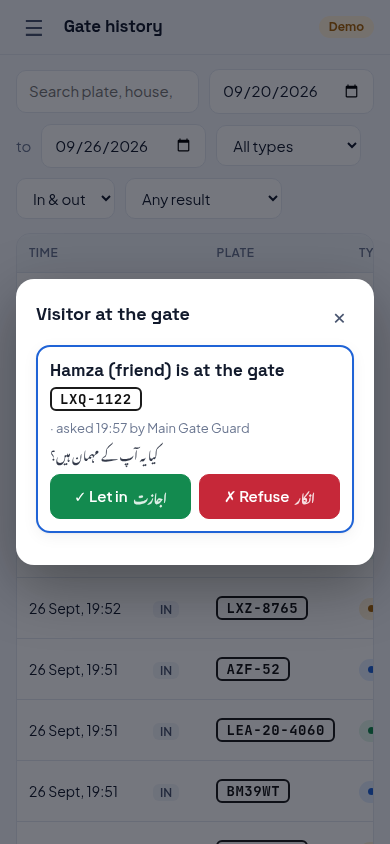

# TwinStack ANPR

Automatic number plate recognition for Pakistani vehicles. Upload a CCTV clip or a photo, watch every vehicle get detected, tracked and its number plate read live, then browse the vehicle log, parking sessions and watchlist alerts.

**Live demo:** https://anpr.twinstackstudio.com



## What it does

- **Reads Pakistani plates** from Punjab, Sindh, Islamabad and KP, including two-line plates with the registration year (LEA-20-4060) and suffix letters (LE-16-5471A).
- **Tracks every vehicle** (car, bike, bus, truck) through the clip and reads its plate many times, then votes on the best reading.
- **Live processing view:** the annotated video streams to the browser while the clip is analysed.
- **Vehicle log** with plate crops, time, gate and confidence, searchable by plate.
- **Parking:** clips uploaded as *Entry gate* open a session per plate, clips uploaded as *Exit gate* close it and compute the fee.
- **Watchlist:** blacklist, VIP and staff plates are flagged whenever they are read.

| Photo mode | Vehicle log | Phone |
|---|---|---|
|  |  |  |

## TwinStack Gate: society gate management

A complete gate system for housing societies, built on the same ANPR pipeline, at https://anpr.twinstackstudio.com/society/ (demo password `demo1234` for `admin`, `guard` and `resident`).

- **Live cameras** (RTSP / HTTP stream, or a simulated camera in the demo): every vehicle read at the gate becomes a gate event.
- **Automatic decision:** resident, staff and service vehicles are allowed, visitors with a valid pass are allowed, blacklisted vehicles raise a red alert, unknown vehicles wait for the guard (English and Urdu prompts).
- **Guard screen:** live video, pending vehicles with plate and vehicle photos, one-tap allow / deny, manual plate or pass-code check, clip upload.
- **Management:** dashboard, gate log with CSV export, vehicles inside now and long stays, houses and vehicles (CSV import), visitor passes, blacklist, cameras, accounts and settings.
- **Resident portal:** own vehicles, who from the house is inside, visitor passes with a 6-letter code, and the house's gate history.
- **Barrier control:** the boom barrier opens by itself for allowed vehicles (and when the guard allows one), through a network relay wired to the barrier's "open" input (any relay with an HTTP URL, e.g. Shelly). The guard can open it by hand; every opening is logged. Simulated in the online demo.
- **Resident approval:** for an unknown vehicle the guard taps *Ask resident*; the house gets a phone notification (Web Push, with Let in / Refuse buttons) or an in-app pop-up. The guard sees the answer and still makes the final decision. Management can turn this off. The app installs to the phone's home screen (needed for notifications on iPhone).

| Dashboard | Guard screen | Resident (phone) | Visitor approval |
|---|---|---|---|
|  |  |  |  |

## How it works

```
video frame ─► YOLO11m vehicles ─► ByteTrack IDs
                    │
                    └─► crop each vehicle ─► YOLO11s plate detector (ours)
                                                  │
                                                  └─► plate crop ─► CCT OCR (fine-tuned by us)
                                                                         │
                         Pakistani plate rules ◄─ vote over frames ◄─────┘
                                  │
                        log · parking · watchlist (PostgreSQL)
```

1. **Vehicle detection and tracking.** YOLO11m (COCO) finds cars, bikes, buses and trucks; ByteTrack keeps an ID per vehicle.
2. **Plate detection, trained by us.** YOLO11s fine-tuned on 1,578 photos of Pakistani plates merged from four public datasets (`training/build_plate_dataset.py`, `training/train_plate_detector.py`). It runs inside each vehicle crop, so small plates far from the camera are still found and every plate belongs to a vehicle.
3. **Plate OCR, trained by us.** The compact vision-transformer OCR from [fast-plate-ocr](https://github.com/ankandrew/fast-plate-ocr) (`cct_s_v2_global`) fine-tuned on 1,471 hand-checked Pakistani plate crops, with augmentation that imitates CCTV footage: blur, low resolution, tilt, glare and JPEG artefacts (`training/ocr/train_ocr.py`).
4. **Pakistani plate rules.** `app/plates.py` splits a reading into letters, optional year, number and optional suffix, and fixes look-alike characters by position (0/O, 8/B, 5/S, 1/I).
5. **Voting and filtering.** Readings of the same vehicle are weighted by confidence and plate size. Weak or one-off readings are dropped, and tracks that were split by occlusion are merged when they read the same plate.

### Results

| Model | Test set | Result |
|---|---|---|
| Plate detector (YOLO11s, 960 px) | 189 held-out photos | precision 1.00, recall 0.974, mAP50 0.975 |
| OCR, before fine-tuning | 139 crops of 55 vehicles never seen in training | 79.1% full plates correct |
| OCR, after fine-tuning | same | **87.8%** full plates correct, 97.4% character similarity |

The remaining OCR errors are almost all on custom-font plates (italic or stylised numbers). Processing speed is about 8 frames per second on 4K video on one RTX 2080 Ti, faster on 1080p.

## Run it

Needs Python 3.12, an NVIDIA GPU, PostgreSQL and ffmpeg.

```bash
python3 -m venv .venv
.venv/bin/pip install torch torchvision --index-url https://download.pytorch.org/whl/cu124
.venv/bin/pip install -r requirements.txt
.venv/bin/pip install --no-deps fast-plate-ocr==1.1.0

# models: YOLO11m from Ultralytics, our two models from the GitHub release
mkdir -p models
curl -L -o models/yolo11m.pt https://github.com/ultralytics/assets/releases/download/v8.4.0/yolo11m.pt
curl -L -o models/plate_detector.pt https://github.com/twinstack-studio/anpr/releases/latest/download/plate_detector.pt
curl -L -o models/pk_plate_ocr.keras https://github.com/twinstack-studio/anpr/releases/latest/download/pk_plate_ocr.keras

createdb anpr
ANPR_DSN="postgresql:///anpr" .venv/bin/uvicorn app.server:app --port 9517
```

Open http://127.0.0.1:9517. Tests: `.venv/bin/python -m pytest tests`.

## Training

```bash
# plate detector: put the Kaggle datasets in datasets/ (see build_plate_dataset.py), then
.venv/bin/python training/build_plate_dataset.py
.venv/bin/python training/train_plate_detector.py

# OCR: cut crops, review them (review_grid.py renders numbered sheets), apply corrections.txt, fine-tune
.venv/bin/python training/ocr/make_crops.py
KERAS_BACKEND=torch PUBLISH=1 .venv/bin/python training/ocr/train_ocr.py
```

Data: Pakistani plate datasets from Kaggle and Roboflow Universe (CC BY 4.0). Demo video: "Lahore Roads Traffic" from Pexels.

## Project layout

```
app/        FastAPI server, ANPR pipeline, OCR wrapper, plate rules, society gate app (society.py)
web/        dashboard (HTML, CSS, vanilla JS); web/society/ is the gate app
training/   dataset builder, plate detector and OCR training
scripts/    demo sample seeding
tests/      plate rules and gate rules tests
```

## License

All rights reserved. © TwinStack Studio. Built by [TwinStack Studio](https://twinstackstudio.com).
